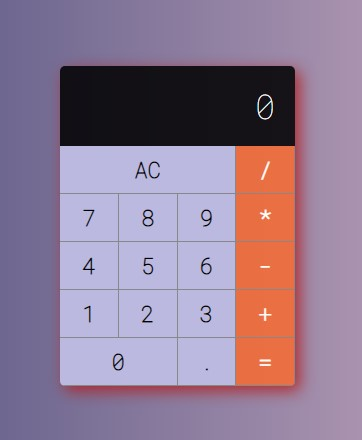

<h1 align="center">Calculadora</h1>

## Objetivo
Calculadora desenvolvida a partir dos conceitos básicos da biblioteca React.

<h1 align="center">
  
</h1>

## Tecnologias / Ferramentas / Bibliotecas
- React
- JavaScript
- HTML
- CSS

## Status
- [x] Finalizado (21/01/2021)

## Links
- [Udemy](https://www.udemy.com/)
- [React](https://reactnative.dev/)
- [uiGradients](https://uigradients.com/)
